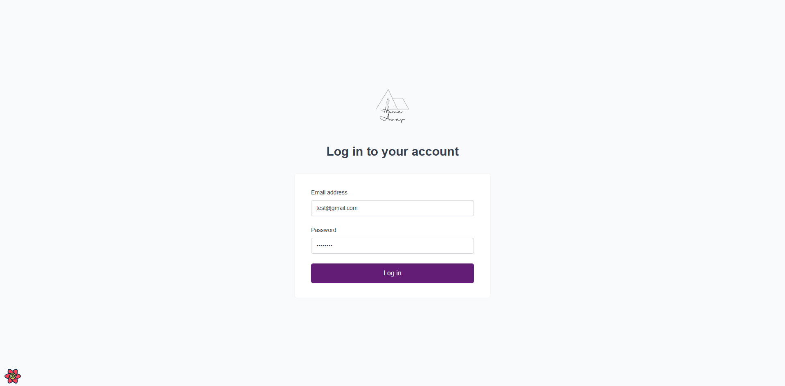
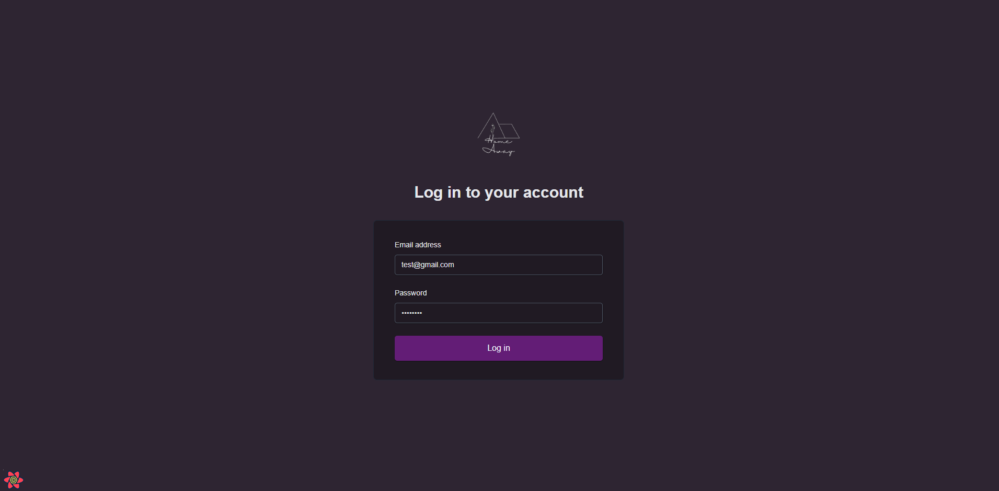
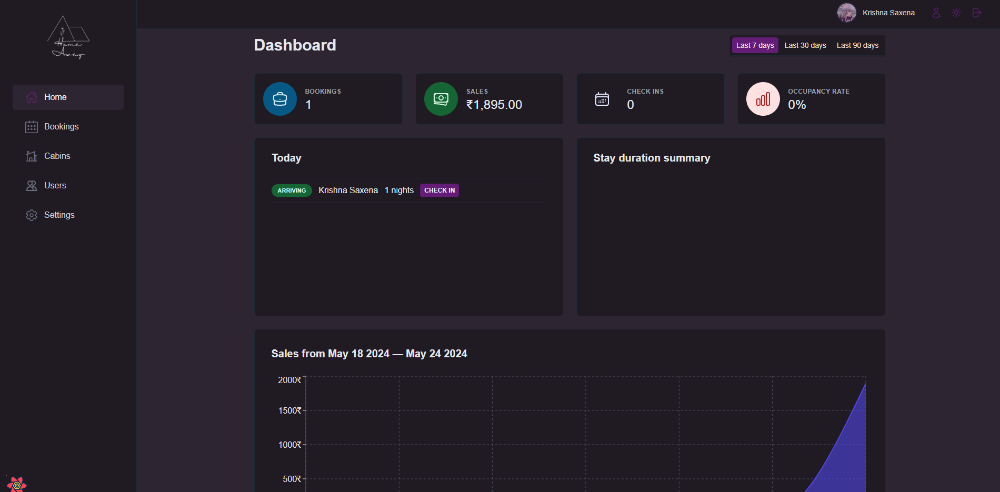
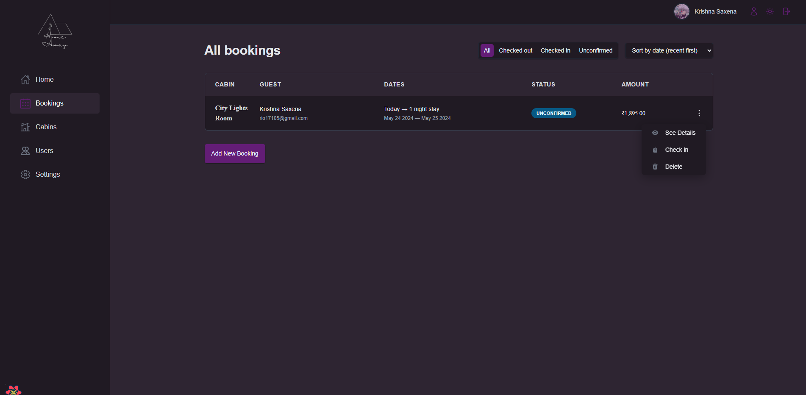
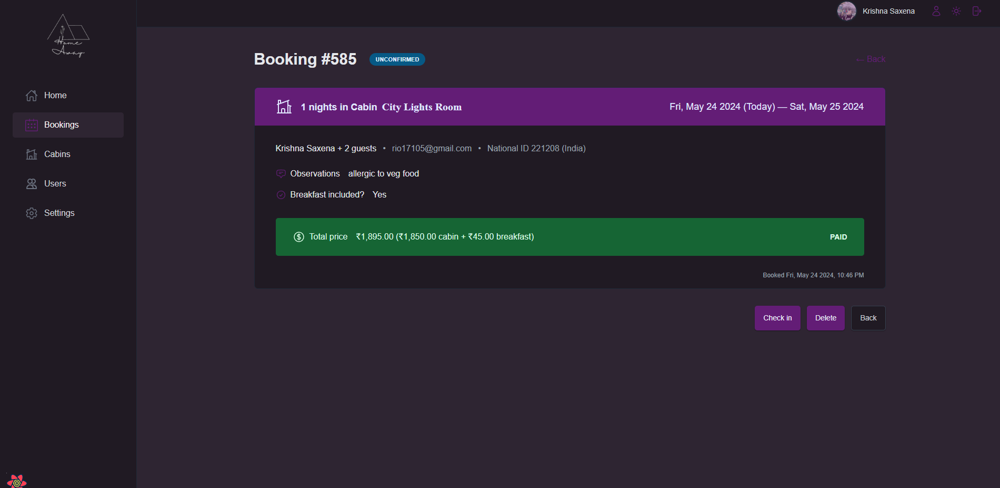
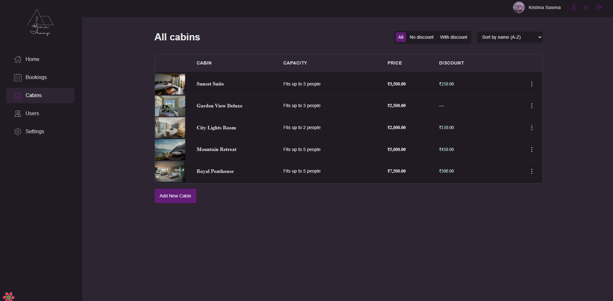
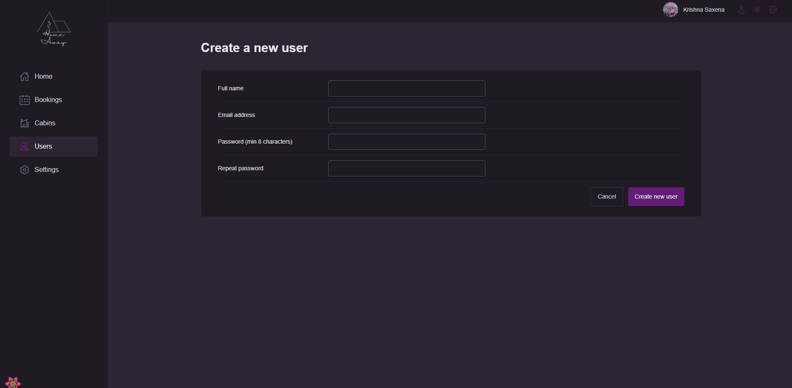
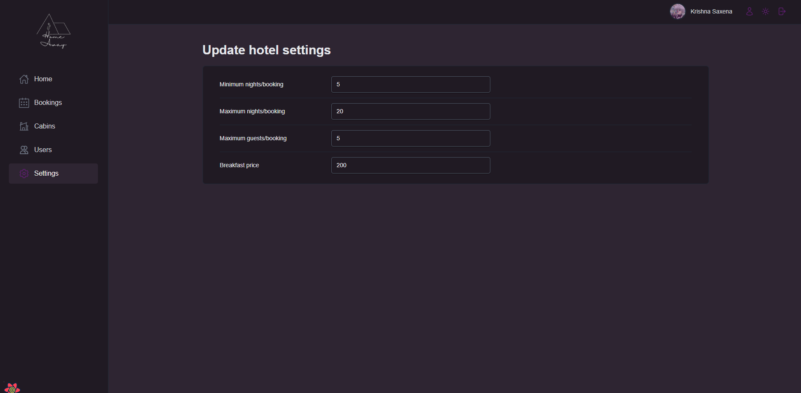

# Home Away: Streamlined Hotel Management

Elevate your hotel's operations with Home Away, an innovative app built with React, Supabase, and Styled Components. Effortlessly manage suites, guest bookings, and hotel settings. Add users, check in guests, and process check-outs seamlessly. Customize policies like booking nights, guest limits, and breakfast pricing. Gain valuable insights with our dynamic dashboard and Recharts-powered visuals. Switch between light and dark modes for optimal viewing. Simplify your hotel management with Home Away!

## Features

- **User Authentication:** Allows management staff to sign up, log in, and manage their profiles securely.
- **Suite Management:** Enables the creation, updating, and deletion of various suites with detailed descriptions, photos, pricing, and availability.
- **Booking Management:** Facilitates the creation and management of guest bookings, including check-in and check-out processes.
- **Settings Configuration:** Customize hotel policies such as minimum and maximum nights per booking, maximum guests per booking, and breakfast pricing.
- **Dashboard Analytics:** Showcases various charts powered by Recharts, providing detailed insights into bookings and hotel performance.
- **Dark/Light Mode:** Switch between dark and light modes for a comfortable user experience using context.

## Technologies Used

- **Supabase:** Backend as a service to handle database operations, authentication, and API routes.
- **React.js:** Frontend library for building user interfaces.
- **Styled Components:** CSS-in-JS library for styling the user interface.
- **Recharts:** Library for building responsive charts and data visualizations.
- **JavaScript (ES6+):** Programming language for both frontend and backend development.
- **HTML/CSS:** Markup and styling for the user interface.

## Screenshots/Demo

